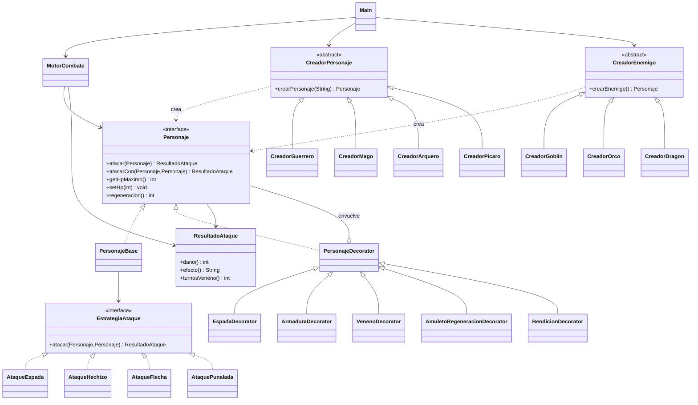
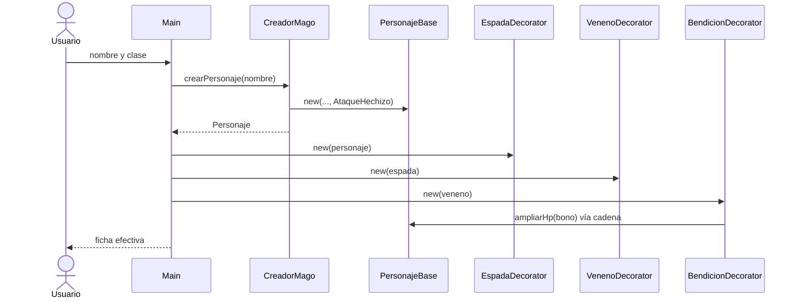
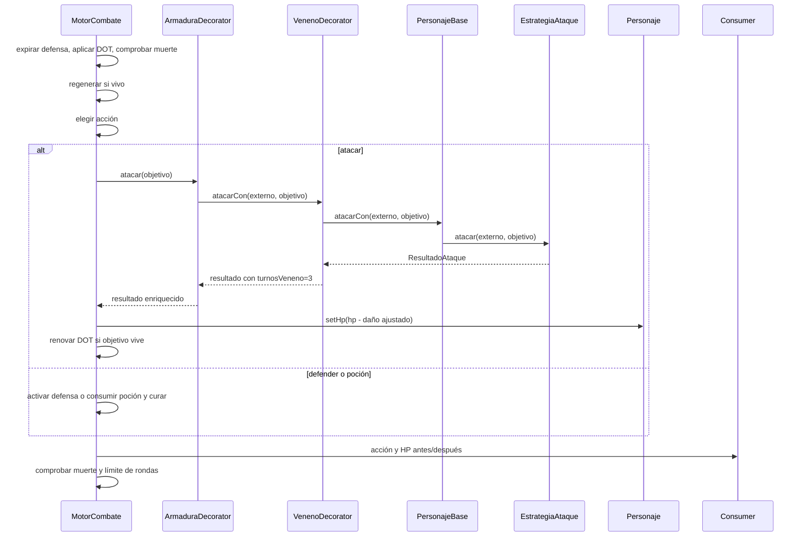

# Diagramas del código final

```mermaid
classDiagram
class Personaje {
 <<interface>>
 +atacar(Personaje) ResultadoAtaque
 +atacarCon(Personaje,Personaje) ResultadoAtaque
 +getHpMaximo() int
 +setHp(int) void
 +regeneracion() int
}
Personaje <|.. PersonajeBase
Personaje <|.. PersonajeDecorator
PersonajeDecorator o-- Personaje : envuelve
PersonajeBase --> EstrategiaAtaque
class EstrategiaAtaque {
 <<interface>>
 +atacar(Personaje,Personaje) ResultadoAtaque
}
Personaje --> ResultadoAtaque
class ResultadoAtaque {
 +dano() int
 +efecto() String
 +turnosVeneno() int
}
class CreadorPersonaje {
 <<abstract>>
 +crearPersonaje(String) Personaje
}
class CreadorEnemigo {
 <<abstract>>
 +crearEnemigo() Personaje
}
CreadorPersonaje ..> Personaje : crea
CreadorEnemigo ..> Personaje : crea
MotorCombate --> Personaje
MotorCombate --> ResultadoAtaque
Main --> MotorCombate
Main --> CreadorPersonaje
Main --> CreadorEnemigo
CreadorPersonaje <|-- CreadorGuerrero
CreadorPersonaje <|-- CreadorMago
CreadorPersonaje <|-- CreadorArquero
CreadorPersonaje <|-- CreadorPicaro
CreadorEnemigo <|-- CreadorGoblin
CreadorEnemigo <|-- CreadorOrco
CreadorEnemigo <|-- CreadorDragon
EstrategiaAtaque <|.. AtaqueEspada
EstrategiaAtaque <|.. AtaqueHechizo
EstrategiaAtaque <|.. AtaqueFlecha
EstrategiaAtaque <|.. AtaquePunalada
PersonajeDecorator <|-- EspadaDecorator
PersonajeDecorator <|-- ArmaduraDecorator
PersonajeDecorator <|-- VenenoDecorator
PersonajeDecorator <|-- AmuletoRegeneracionDecorator
PersonajeDecorator <|-- BendicionDecorator
```

Se omiten getters repetidos y métodos privados para legibilidad.

```mermaid
sequenceDiagram
actor Usuario
participant Main
participant CreadorMago
participant PersonajeBase
participant EspadaDecorator
participant VenenoDecorator
participant BendicionDecorator
Usuario->>Main: nombre y clase
Main->>CreadorMago: crearPersonaje(nombre)
CreadorMago->>PersonajeBase: new(..., AtaqueHechizo)
CreadorMago-->>Main: Personaje
Main->>EspadaDecorator: new(personaje)
Main->>VenenoDecorator: new(espada)
Main->>BendicionDecorator: new(veneno)
BendicionDecorator->>PersonajeBase: ampliarHp(bono) vía cadena
Main-->>Usuario: ficha efectiva
```

```mermaid
sequenceDiagram
participant Motor as MotorCombate
participant Externo as ArmaduraDecorator
participant Veneno as VenenoDecorator
participant Base as PersonajeBase
participant Estrategia as EstrategiaAtaque
participant Objetivo as Personaje
participant Log as Consumer
Motor->>Motor: expirar defensa, aplicar DOT, comprobar muerte
Motor->>Motor: regenerar si vivo
Motor->>Motor: elegir acción
alt atacar
Motor->>Externo: atacar(objetivo)
Externo->>Veneno: atacarCon(externo, objetivo)
Veneno->>Base: atacarCon(externo, objetivo)
Base->>Estrategia: atacar(externo, objetivo)
Estrategia-->>Veneno: ResultadoAtaque
Veneno-->>Externo: resultado con turnosVeneno=3
Externo-->>Motor: resultado enriquecido
Motor->>Objetivo: setHp(hp - daño ajustado)
Motor->>Motor: renovar DOT si objetivo vive
else defender o poción
Motor->>Motor: activar defensa o consumir poción y curar
end
Motor->>Log: acción y HP antes/después
Motor->>Motor: comprobar muerte y límite de rondas
```
